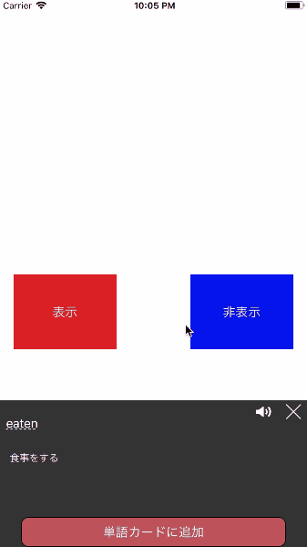

# PopCard
[](./license-apache.md)

[](https://github.com/Carthage/Carthage)

easily you can use wordCard.

#sample

## Features

- showing wordCard easily.

## How to Use

**initialize**

```Swift
 popCard = PopCard(
    word: "eat", text: "cause to deteriorate due to the action of water, air, or an acid",
    lang: "en"
 )
```

**show Up Card**

```Swift
popCard.showView()
```

**Hide  Card**
```Swift
popCard.dawinView()
```

**Protocol**
-when using PreserveButton, you can use this Protocol
```Swift
public protocol popCardProtcol{
    func wordPreserve(_ word:String,text:String)
}
```

and set delegate.

```Switt
popCard.delegate = self
```


## Runtime Requirements

- iOS 11.0 or later
- Xcode 9.0 - Swift4

## Installation and Setup
### Installing with Carthage
Just add to your Cartfile:

```ogdl
github "kcwebapply/PopCard"
```
## Contribution

Please file issues or submit pull requests for anything you’d like to see! We're waiting! :)

## License
PopCard.swift is released under the MIT license. Go read the LICENSE file for more information.
